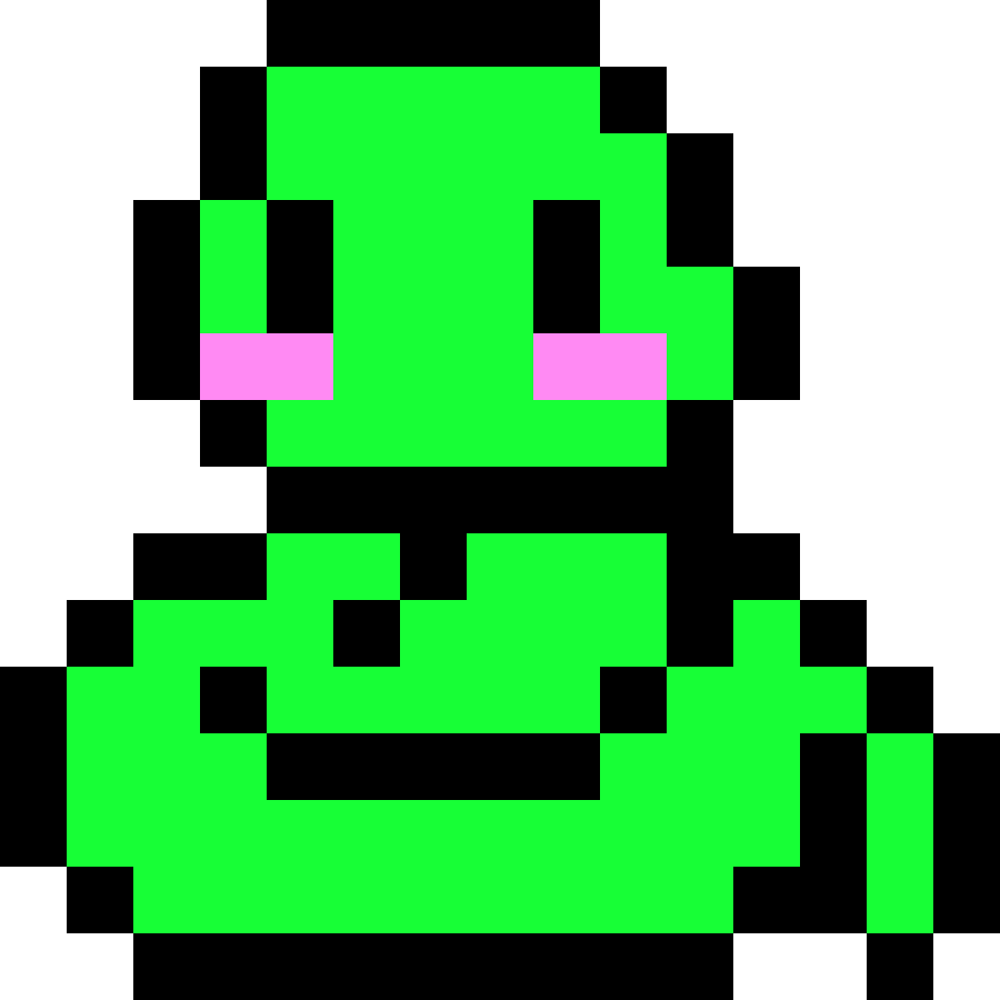

# 🐍Python-in-Phyton🐍

  

Este proyecto se basa en demostrar que al igual que python, los videojuegos son un campo super amplio. La idea es usar una biblioteca que no está diseñada para juegos, sino para interfaces sencillas y aprendizaje de niños como es Turtle, para crear un juego clásico en sus dos versiones y tener ambas en gitHub. Antes de empezar a dar una breve explicación, aclarar que los comentarios solo están disponibles en la versión para un jugador (el primer commit), en la versión multijugador no son necesarios pues son practicamente las mismas funciones. También tener en cuenta que la explicación dada a continuación se basa en la versión final multijugador.

# 🕹️Controles
Para el jugador 1:  ↑ ← ↓ →

Para el jugador 2:  W A S D

# 🖥️Creación de clases, 🪟Ventana y ♾️Funciones de Reinicio
Para empezar y utilizar clases en el proyecto, creé la serpiente y la comida como clases, las cuales tienen una o más propiedades tipo turtle como es la cabeza y la lista de segmentos en el caso de la serpiente, también presentan propiedades características de Turtle como son la forma, el color o la velocidad. A la hora de crear el juego son necesarios varios elementos, entre ellos una ventana donde colocar y mover las entidades, la cual denominé "window" y un cronómetro para añadir tiempo límite al juego, este último se manifestará mediante un Turtle llamado "contador" que será algo así como su representación visual.
Se crean dos serpientes, una fruta y se declaran ciertas funciones que utilizaremos despues, tales como:

-reiniciarSerpiente: No solo restaurará los puntos de cada jugador a 0, sino que también limpia la lista de segmentos y coloca a las serpientes en el punto de partida.
-reiniciar: Llama a la función reiniciarSerpiente para cada uno de los jugadores.
-ganar: Detiene todo el movimiento en el juego y muestra el mensaje de victoria del ganador, también tiene un pequeño truco para casos de empate.

# 🏃‍♂️💨Movimiento
Luego de esto creé funciones para la dirección y control de las serpientes, estas funciones están validadas para que no se pueda ir en dirección contraria repentinamente (si vas arriba no puedes ir abajo directo, sino que tienes que doblar antes). Luego está la sección de movimiento, dependiento de la dirección aumenta o disminuye valores en las coordenadas X y Y para dezplazar la cabeza de la serpiente. Por último tenemos una serie de listeners con las teclas "wasd" para el jugador 2 y las flechas del teclado para el jugador 1, cada uno llama respectivamente a las funciones de dirección para cada serpiente.

# 💻Otros detalles (Marcadores, Colisiones, Movimiento del cuerpo, Temporizador)
El aumento de marcador no tiene complejidad, dependiendo de la serpiente aumentamos su puntuación y actualizamos el texto de la entidad Turtle relacionada a la puntuación de dicha serpiente.

La colisión con la comida se basa en que cuando la distancia de una cabeza a la comida es de menos de 28 pixeles, esta se teletrasporta a otra ubicación random (utilizando la biblioteca Random) y se aumentan los puntos de la serpiente en cuestión. Además se crea y añade un segmento a la lista de segmentos de la serpiente.

La función mover cuerpo es más compleja, mientras la cabeza siga en movimiento se va a ejecutar, cada segmento va a seguir al siguiente en la lista y el primero se coloca sobre la cabeza, he de confezar de que la superposición del primer segmento y la cabeza surgió como un bug y terminó siendo una mecánica del juego que me gustó bastante.

La colisión con los bordes no tiene nada del otro mundo, si la cabeza pasa de ciertas coordenadas el juego termina y gana el contrincante. Por otro lado la colisión con el cuerpo verifica la distancia de la cabeza de los segmentos de ambas serpientes, excluyendo siempre al primer segmento propio, pues este se superpone a la cabeza (La mecánica consiste en que la primera fruta no extiende el cuerpo, pero si permite a la serpiente comerse a la otra si no ha comido ninguna fruta, solamente tiene que tocarla).

Todo el tema del tiempo es algo complejo, pero en pocas palabras es una verificación en tiempo real para ir decrementando el cronómetro, pues la idea original era usar un semáforo o un timer, pero creaba conflicto con la función update de Turtle.

Por último, dentro del update se llaman todas las funciones de las serpientes (para ambas) y al final se hace un time sleep en la variable posponer para que se pueda ver el movimiento, de lo contrario sería demasiado rápido.

# 📸Imágenes

  

  

# 😊Futuro y Agradecimientos

Ese sería todo el proyecto, obviamente no es perfecto, pero sí le dediqué mucho esfuerzo y me siento satisfecho con los resultados. No creo que prosiga con este proyecto pues solo buscaba la experiencia, tengo pensado aventurarme en otras bibliotecas e ideas nuevas. Gracias por el apoyo y la paciencia de todos los que dieron ideas y colaboraron en el mismo.
